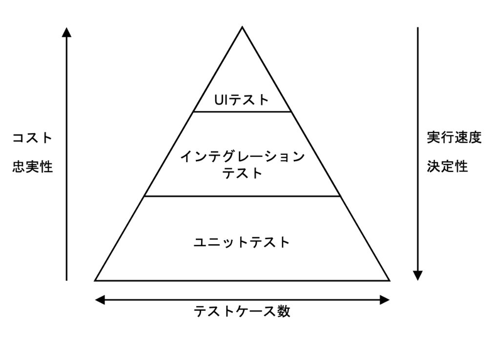
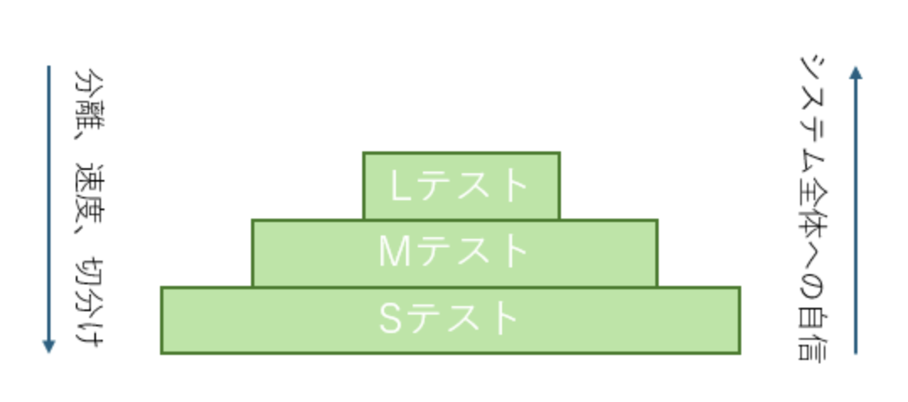
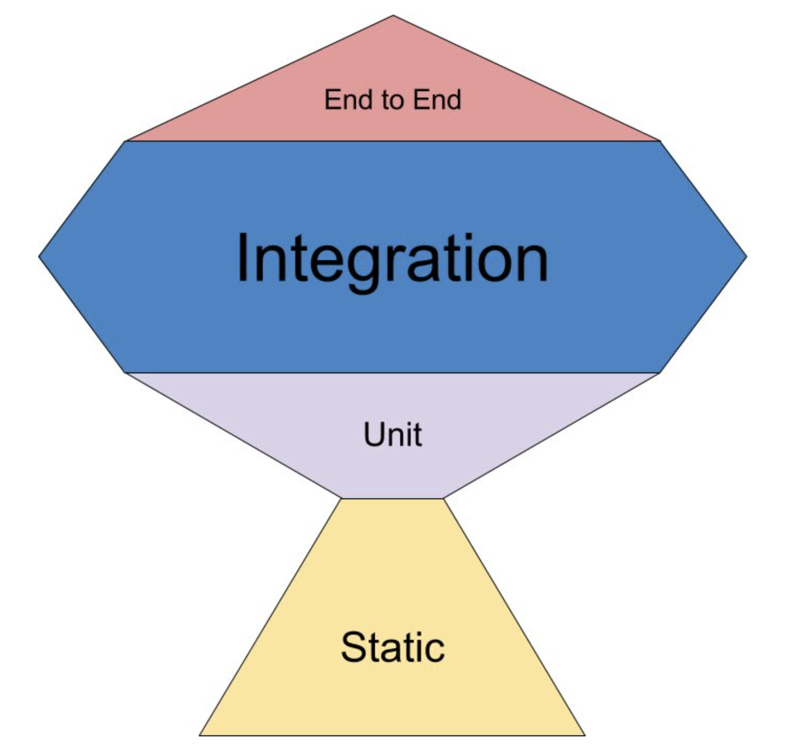

<!-- 表紙 -->
<div class="center-content">

# ソフトウェアテスト講義

## 効果的なテスト戦略の構築と実践


### 2025年4月20日

</div>

---

<!-- 目次ページ -->
# 目次

<div class="columns">

<div>

## テスト講義
- なぜテストを行うのか
- 良いテストとは
  - テストピラミッド
  - テストサイズ
  - Testing Trophy

</div>

<div>

## テスト実践
- セットアップ
- テスト実行
- テストケース作成
- テスト実装

</div>

</div>

---

## なぜテストを行うのか

<div class="center-content" style="height: 70%;">

<div class="question">テストコードを書く理由は？</div>

<div style="height: 40px;"></div>

<div class="answer">テストコードを書く理由とその価値について考えてみましょう</div>

</div>

---

### 開発プロセス

Webアプリケーションを開発する際に、どんなプロセスで開発しますか？

例えばECサイトを開発していて、商品の登録機能を開発する時、下記のようなフローになるのではないでしょうか。

* 商品登録のエンドポイントを作成する
* 商品登録の画面を作成する
* APIの繋ぎこみを行う

---

### あなたは無意識にテストしている

機能が完成すると、きっと下記のようなフローで確認するはずです

* エンドポイント作成後、エンドポイントを実行し、期待するバリデーション、永続化が行われていることを確認し、期待するレスポンスが返却されることを確認する

* 画面作成後、ユースケースに基づくユーザー操作を行い、期待するUIが表示されることを確認する。また、リソースが新規に作成される場合、別画面で反映されることを確認する

---

### 手動テスト

手動テストは立派なテストです。また、テストコードを書けば、手動テストがなくなるわけではありません。

ではなぜテストコードが必要なのでしょうか？

手動テストをやれば、問題ないのではないでしょうか？

---

### こんな時つらい

* 言語のメジャーアップデート
* 主要ライブラリのアップデート
* リファクタリング
* 前提条件の再現に時間はかかるが、各処理は共通の機能

<div class="important-box">
手動テストだけでは、これらの状況で多大な労力が必要になります
</div>

---

### テストコードがあれば

* 言語のメジャーアップデート、主要ライブラリのアップデート時に、最小限の手動テストでリリースが可能です

* 積極的なリファクタリングができます。プログラムは入出力があっていれば良いのです（暴論）

---

### テストコードの価値

言語の積極的なアップデート、ライブラリの積極的なアップデートは、セキュリティの向上、開発効率の向上を同時に達成できます。

積極的なリファクタリングは開発者体験が圧倒的に向上します。

テストが通れば開発者は安心して12時間寝れます。お肌ツヤツヤです。

<div class="important-box">
つまり、テストコードを書くとは、幸せを手に入れると同義です。
</div>

---

## まとめ

<div class="center-content" style="height: 70%;">

<div class="question">Q. なぜテストコードを書くのか？</div>

<div style="height: 40px;"></div>

<div class="answer">A. 幸せになりたいから</div>

</div>

---
## 良いテストとは何か

<div class="center-content" style="height: 70%;">

<div class="question">良いテストの条件とは？</div>

<div style="height: 40px;"></div>

<div class="answer">信頼性があり、保守しやすく、価値を提供するテスト</div>

</div>

---

### テストコードの種類

結合テストと単体テストがあります。現場によって認識のズレが起こりがちなので、今回は下記で定義します：

* インテグレーションテスト（狭義の結合テスト）
  * 画面を操作してテスト
* インテグレーションテスト（広義の結合テスト）
  * APIにリクエストを実際に投げてテスト
* ユニットテスト（単体テスト）
  * 関数を実行してテスト

---


### インテグレーションテスト（狭義の結合テスト）

画面を操作してテストします：

* バリデーション時の振る舞い
* 成功トーストの表示
* エラートーストの表示
* 作成したリソースの表示

---


### インテグレーションテスト（狭義の結合テスト）サンプル

```typescript
// tests/e2e/product-registration.spec.ts
import { test, expect } from '@playwright/test';

test.describe('商品登録機能', () => {
  test('商品を正常に登録できる', async ({ page }) => {
    // ログイン処理
    await page.goto('/login');
    await page.fill('[data-testid="email-input"]', 'admin@example.com');
    await page.fill('[data-testid="password-input"]', 'password123');
    await page.click('[data-testid="login-button"]');
    
    // 商品登録ページへ移動
    await page.goto('/products/new');
    
    // フォーム入力
    await page.fill('[data-testid="product-name"]', 'テスト商品');
    await page.fill('[data-testid="product-price"]', '1000');
    await page.selectOption('[data-testid="product-category"]', 'electronics');
    await page.fill('[data-testid="product-description"]', '商品の説明文です');
    
    // フォーム送信
    await page.click('[data-testid="submit-button"]');
    
    // 成功トーストの表示を確認
    await expect(page.locator('[data-testid="toast-success"]')).toBeVisible();
    await expect(page.locator('[data-testid="toast-success"]')).toContainText('商品が登録されました');
    
    // 商品一覧ページに遷移したことを確認
    await expect(page).toHaveURL('/products');
    
    // 登録した商品が一覧に表示されていることを確認
    await expect(page.locator('text=テスト商品')).toBeVisible();
    await expect(page.locator('text=1000円')).toBeVisible();
  });

  test('入力バリデーションが機能する', async ({ page }) => {
    // ログイン処理
    await page.goto('/login');
    await page.fill('[data-testid="email-input"]', 'admin@example.com');
    await page.fill('[data-testid="password-input"]', 'password123');
    await page.click('[data-testid="login-button"]');
    
    // 商品登録ページへ移動
    await page.goto('/products/new');
    
    // 商品名を入力せずに送信
    await page.fill('[data-testid="product-price"]', '1000');
    await page.click('[data-testid="submit-button"]');
    
    // エラーメッセージが表示されることを確認
    await expect(page.locator('[data-testid="name-error"]')).toBeVisible();
    await expect(page.locator('[data-testid="name-error"]')).toContainText('商品名は必須です');
  });
});
```


---

### インテグレーションテスト（広義の結合テスト）

APIにリクエストを実際に投げてテスト：

* バリデーションの検証
* ステータスコードの検証
* 成功レスポンスの検証
* 永続化されたリソースの検証

---
### インテグレーションテスト（広義の結合テスト）サンプル

```typescript
// tests/integration/product-api.test.ts
import request from 'supertest';
import { app } from '../../src/app';
import { Product } from '../../src/models/product';
import { connectDB, closeDB, clearDB } from '../helpers/db-handler';

describe('商品API統合テスト', () => {
  // テスト前にDBに接続
  beforeAll(async () => {
    await connectDB();
  });

  // 各テスト後にDBをクリア
  afterEach(async () => {
    await clearDB();
  });

  // すべてのテスト後にDB接続を閉じる
  afterAll(async () => {
    await closeDB();
  });

  describe('POST /api/products', () => {
    it('有効なデータで商品を作成できる', async () => {
      const productData = {
        name: 'テスト商品',
        price: 1000,
        category: 'electronics',
        description: '商品の説明文です'
      };

      const response = await request(app)
        .post('/api/products')
        .set('Authorization', 'Bearer test-token')
        .send(productData)
        .expect(201);

      // レスポンスの検証
      expect(response.body).toHaveProperty('id');
      expect(response.body.name).toBe(productData.name);
      expect(response.body.price).toBe(productData.price);

      // DBに永続化されていることを確認
      const savedProduct = await Product.findById(response.body.id);
      expect(savedProduct).not.toBeNull();
      expect(savedProduct?.name).toBe(productData.name);
      expect(savedProduct?.price).toBe(productData.price);
    });

    it('バリデーションエラーが適切に処理される', async () => {
      const invalidProductData = {
        // 名前がない
        price: 1000,
        category: 'electronics'
      };

      const response = await request(app)
        .post('/api/products')
        .set('Authorization', 'Bearer test-token')
        .send(invalidProductData)
        .expect(400);

      // エラーレスポンスの検証
      expect(response.body).toHaveProperty('errors');
      expect(response.body.errors).toContainEqual({
        field: 'name',
        message: '商品名は必須です'
      });

      // DBにデータが保存されていないことを確認
      const productsCount = await Product.countDocuments();
      expect(productsCount).toBe(0);
    });
  });
});
```

---

### ユニットテスト（単体テスト）

関数を実行してテスト：

* 引数を与えた時のreturnをテスト
* 依存関係がある場合、モックしてテスト

---

### ユニットテスト（単体テスト）サンプル(依存関係なし)

```typescript
// tests/unit/price-calculator.test.ts
import { calculateTotalPrice, applyDiscount } from '../../src/utils/price-calculator';

describe('価格計算ユニットテスト', () => {
  describe('calculateTotalPrice関数', () => {
    it('商品の合計金額を計算できる', () => {
      const items = [
        { name: '商品A', price: 100, quantity: 2 },
        { name: '商品B', price: 200, quantity: 1 }
      ];
      
      const result = calculateTotalPrice(items);
      
      // 100 * 2 + 200 * 1 = 400
      expect(result).toBe(400);
    });
    
    it('商品がない場合は0を返す', () => {
      const result = calculateTotalPrice([]);
      expect(result).toBe(0);
    });
  });
  
  describe('applyDiscount関数', () => {
    it('通常の割引計算ができる', () => {
      // 1000円の10%割引 = 900円
      const result = applyDiscount(1000, 10);
      expect(result).toBe(900);
    });
    
    it('割引率が0の場合は元の価格を返す', () => {
      const result = applyDiscount(1000, 0);
      expect(result).toBe(1000);
    });
    
    it('割引率が100%の場合は0を返す', () => {
      const result = applyDiscount(1000, 100);
      expect(result).toBe(0);
    });
    
    it('割引率が負の値の場合は例外を投げる', () => {
      expect(() => applyDiscount(1000, -10)).toThrow('割引率は0以上100以下である必要があります');
    });
    
    it('割引率が100を超える場合は例外を投げる', () => {
      expect(() => applyDiscount(1000, 110)).toThrow('割引率は0以上100以下である必要があります');
    });
  });
});
```

---


### ユニットテスト（単体テスト）サンプル(依存関係あり)

```typescript
// tests/unit/product-service.test.ts
import { ProductService } from '../../src/services/product-service';
import { ProductRepository } from '../../src/repositories/product-repository';

// ProductRepositoryのモック
jest.mock('../../src/repositories/product-repository');

describe('商品サービスユニットテスト（依存関係あり）', () => {
  let productService: ProductService;
  let mockProductRepository: jest.Mocked<ProductRepository>;

  beforeEach(() => {
    // モックをリセット
    jest.clearAllMocks();
    mockProductRepository = new ProductRepository() as jest.Mocked<ProductRepository>;
    productService = new ProductService(mockProductRepository);
  });

  describe('findProductsInCategory', () => {
    it('指定したカテゴリの商品を取得できる', async () => {
      // モックの戻り値を設定
      const mockProducts = [
        { id: '1', name: '商品A', price: 1000, category: 'electronics' },
        { id: '2', name: '商品B', price: 2000, category: 'electronics' }
      ];
      mockProductRepository.findByCategory.mockResolvedValue(mockProducts);

      // テスト対象メソッド実行
      const result = await productService.findProductsInCategory('electronics');

      // 結果の検証
      expect(result).toEqual(mockProducts);
      expect(result.length).toBe(2);
      
      // リポジトリメソッドが正しく呼ばれたか検証
      expect(mockProductRepository.findByCategory).toHaveBeenCalledWith('electronics');
      expect(mockProductRepository.findByCategory).toHaveBeenCalledTimes(1);
    });

    it('カテゴリに商品がない場合は空配列を返す', async () => {
      // モックの戻り値を設定（空配列）
      mockProductRepository.findByCategory.mockResolvedValue([]);

      // テスト対象メソッド実行
      const result = await productService.findProductsInCategory('non-existent');

      // 結果の検証
      expect(result).toEqual([]);
      expect(result.length).toBe(0);
      
      // リポジトリメソッドが正しく呼ばれたか検証
      expect(mockProductRepository.findByCategory).toHaveBeenCalledWith('non-existent');
    });
  });
});
```
---

### テストピラミッド

<div class="center-content" style="height: 80%;">



テストの種類とバランスを示す重要な概念

</div>

---

### テストピラミッドとは

テストピラミッドは、効果的なテスト戦略の指針となるモデルです

<div class="columns">

<div>

## 基本構成
- **単体テスト（ユニットテスト）** - 底辺
- **結合テスト（インテグレーションテスト）** - 中央  
- **E2Eテスト（UIテスト）** - 頂点

</div>

<div>

## 重要な特徴
- 下層ほどテスト数が多い
- 上層ほど実行速度が遅い
- 下層ほどメンテナンスコストが低い

</div>

</div>

---

### 各テストの役割と特徴

<div class="columns">

<div>

## **単体テスト（ユニットテスト）**
- 関数・メソッド単位のテスト
- 最も速く実行される
- <span class="highlight">70%〜80%</span>の比率が理想

</div>

<div>

## **結合テスト**
- API、DBを含むテスト
- 中程度の実行速度
- <span class="highlight">15%〜20%</span>の比率が理想

</div>

</div>

## **E2Eテスト（UIテスト）**
- ブラウザ操作を含むテスト
- 最も実行が遅い
- <span class="highlight">5%〜10%</span>の比率が理想

---

### なぜピラミッド型なのか

<div class="columns">

<div>

## 速度の違い
- 単体テスト: **ミリ秒〜秒**オーダー
- 結合テスト: **秒〜分**オーダー  
- E2Eテスト: **分〜時間**オーダー

</div>

<div>

## メンテナンスコスト
- 単体テスト: **最も低い**
- 結合テスト: **中程度**
- E2Eテスト: **最も高い**

</div>

</div>

<div style="margin-top: 2rem; padding: 1rem; background: #f8f9fa; border-radius: 8px;">

<div class="important-box">
<strong>速く、安く、大量に実行できるテストを基盤とし、<br>
遅く、高くつくテストは必要最小限にすることで、<br>
効率的な品質保証を実現する</strong>
</div>

</div>

---

### テストピラミッドの実践的メリット

<div class="columns">

<div>

## **開発速度の向上**
- CI/CDパイプラインの高速化
- 素早いフィードバックループ
- 開発中の即時確認が可能

</div>

<div>

## **メンテナンス効率**
- 単体テストの修正が容易
- リファクタリング時の安心感
- テストの依存関係が少ない

</div>

</div>

<div style="margin-top: 2rem;">

## **経済性**
- CI/CD実行時間の短縮 → コスト削減
- デバッグ時間の削減 → 開発効率向上
- 障害発生時の早期発見・修正

</div>

---

### テストピラミッドの実践テクニック

<div class="columns">

<div>

## **単体テストの最適化**
- 依存関係のモック化
- 明確なテスト名 
- Given-When-Then構造
- 1テスト1アサーション

</div>

<div>

## **E2Eテストの効率化**
- 重要なユースケースに絞る
- 並列実行の活用
- テストデータの準備戦略
- 失敗時のスクリーンショット

</div>

</div>

---

### まとめ：テストピラミッド

<div class="center-content" style="height: 80%;">

**効果的なテスト戦略の3つのポイント**

1. **単体テストを基盤に**（全体の70-80%）
2. **適切な結合テスト**（全体の15-20%）
3. **最小限のE2Eテスト**（全体の5-10%）

<div style="margin-top: 2rem; padding: 1rem; background: #e3f2fd; border-radius: 8px;">
速く、安く、大量に実行できるテストを基盤とすることで、<br>
<strong>持続可能で効率的な品質保証</strong>を実現できます
</div>

</div>

---
### テストサイズ

<div class="center-content" style="height: 80%;">



実行時間とリソースに基づくテスト分類

</div>

---

### 従来の分類法の問題点

<div class="columns">

<div>

## 単体テスト・結合テストの混乱

- 「単体テスト」の定義が曖昧
- 関数単位？コンポーネント単位？
- DBや外部リソースの扱いは？
- <span class="highlight">チームによって解釈が異なる</span>

</div>

<div>

## CI/CDにおける課題

- 実行時間がキー
- ビルドのたびに5分待てない
- テストスキップが横行
- <span class="highlight">継続的テストには明確な基準が必要</span>

</div>

</div>

---

### テストサイズの概念

Google流の**実行時間ベース**のテスト分類

<div class="columns">

<div>

## **基本原則**
- 実行時間に着目
- 使用可能リソースを定義
- 明確な基準で分類
- 組織で調整可能

</div>

<div>

## **分類の特徴**
- S/M/L/Enormousの4段階
- それぞれにタイムアウト設定
- リソース制限を明確化
- CI/CDパイプラインに最適

</div>

</div>

---

### テストサイズの詳細

<div style="font-size: 0.9em;">

| テストサイズ | 総実行時間 | 個別テスト | 使用可能リソース |
|------------|-----------|------------|-----------------|
| **Small (S)** | 1分以下 | 100ms以下 | メモリのみ |
| **Medium (M)** | 5分以下 | 1秒前後 | ローカルDB、ファイル |
| **Large (L)** | 15分以下 | - | コンテナ、外部API |
| **Enormous** | 1時間以下 | - | 共用環境、本番相当 |

</div>

---

### Smallテスト（Sテスト）

<div class="columns">

<div>

## **特徴**
- 純粋なコードテスト
- 1分以内に全て完了
- 個別テストは100ms以下
- メモリ内のみで動作

</div>

<div>

## **用途**
- 関数・メソッドのテスト
- ロジックの検証
- 境界条件のテスト
- すべてのビルド時に実行

</div>

</div>

<div style="margin-top: 2rem; padding: 1rem; background: #f8f9fa; border-radius: 8px;">
<strong>ポイント：</strong>DBやファイルにアクセスする場合は<strong>テストダブル（モック）</strong>を使用
</div>

---

### Mediumテスト（Mテスト）

<div class="columns">

<div>

## **特徴**
- 5分以内に全て完了
- 個別テストは1秒前後
- RDB、ファイル使用可能
- コンテナ利用可能

</div>

<div>

## **用途**
- DBを含むユニットテスト
- 複数コンポーネントの結合
- API統合テスト
- Push時に実行

</div>

</div>

<div style="margin-top: 2rem; padding: 1rem; background: #f8f9fa; border-radius: 8px;">
<strong>ポイント：</strong>実環境に近い状態でテスト可能
</div>

---

### Large/Enormousテスト

<div class="columns">

<div>

## **Largeテスト（Lテスト）**
- 15分以内に完了
- 実環境へのデプロイ
- ブラウザテスト
- PR作成時に実行

</div>

<div>

## **Enormousテスト**
- 1時間以内に完了
- 本番同等環境
- 大規模リグレッション
- 日次実行

</div>

</div>

<div style="margin-top: 2rem; padding: 1rem; background: #fff3e0; border-radius: 8px;">
<strong>注意：</strong>実行コストが高く、テスト失敗時の原因特定が難しい
</div>

---

### テストサイズピラミッド

<div class="center-content" style="height: 80%;">

<div style="display: flex; justify-content: center; align-items: center; flex-direction: column;">

```
      ┌─────────────────┐  Enormous (5%)
     ┌┴─────────────────┴┐
    ┌┴─────────────────┬─┴┐ Large (15%)
   ┌┴──────────────────┴┬─┴┐
  ┌┴───────────────────┬┴─┬┴┐ Medium (30%)
 ┌┴────────────────────┴┬─┴─┴┐
┌┴──────────────────────┴┬┴──┬┴┐ Small (50%)
└────────────────────────┴───┴─┘
```

</div>

<div style="margin-top: 1rem;">
<strong>理想的な分布：</strong>下層ほど多く、上層ほど少なく
</div>

</div>

---

### CI/CDパイプラインとの関係

| テストサイズ | 実行タイミング | 実行者 |
|------------|-------------|-------|
| **Small** | すべてのビルド時 | 開発者・CI |
| **Medium** | Push時 | CI |
| **Large** | Pull Request時 | CI |
| **Enormous** | 日次・週次 | CI |

<div style="margin-top: 2rem; padding: 1rem; background: #e3f2fd; border-radius: 8px;">
<strong>重要：</strong>実行頻度が高いほど、実行時間を短く保つ必要がある
</div>

---

### メリットと導入のポイント

<div class="columns">

<div>

## **メリット**
- 明確な分類基準
- CI/CDに最適化
- チーム間の認識統一
- 実行時間の予測可能性

</div>

<div>

## **導入のポイント**
- 実行時間の計測から開始
- 段階的な分類移行
- 組織に合わせた調整
- 継続的な改善

</div>

</div>

---

### まとめ：テストサイズ

<div class="center-content" style="height: 80%;">

**実行時間ベースの明確な分類**

1. **Small：** 1分以内、メモリのみ
2. **Medium：** 5分以内、DB・ファイル可
3. **Large：** 15分以内、デプロイあり
4. **Enormous：** 1時間以内、本番相当

<div style="margin-top: 2rem; padding: 1rem; background: #e3f2fd; border-radius: 8px;">
<strong>CI/CD時代に必須：</strong><br>
時間とリソースに基づく<strong>実用的な</strong>テスト分類
</div>

</div>

---
### Testing Trophy

<div class="center-content" style="height: 80%;">



Kent C. Dodds氏が提唱するテスト戦略

</div>

---

### Testing Trophyとは

<div class="columns">

<div>

## **コンセプト**
- **結合テスト**に重点を置く
- 品質保証を考慮した考え方
- ユーザー体験を重視

</div>

<div>

## **ピラミッドとの違い**
- ピラミッド：面積で表す
- トロフィー：**体積**で表す
- 結合テストが最も重要
- 実装の詳細をテストしない

</div>

</div>

---

### 各テストの種類と特徴

<div style="font-size: 0.9em;">

| テスト種類 | 説明 | 主なツール |
|----------|------|-----------|
| **Static** | 静的解析、型チェック | TypeScript、ESLint |
| **Unit** | 個別の関数・コンポーネント | Jest |
| **Integration** | 複数コンポーネントの連携 | Jest React Testing Library |
| **E2E** | ユーザー操作の再現 | Cypress、Selenium |

</div>

---

### 結合テストの重要性

<div class="columns">

<div>

## **なぜ結合テストなのか**
- 信頼性とコストのバランス
- ユーザーの実際の操作に近い
- <span class="highlight">最もROIが高い</span>
- リファクタリングに強い

</div>

<div>

## **フロントエンドでの実践**
- 個別コンポーネント → Unit
- **ページ全体 → Integration**
- アプリ全体 → E2E
- API/DBはMockを使用

</div>

</div>

---
### 実装の詳細をテストしない

<div class="columns">

<div>

## **避けるべきテスト対象**

- コンポーネントの内部状態
- 内部メソッド
- ライフサイクルメソッド
- 子コンポーネントの実装詳細

</div>

<div>

## **代わりにテストすべきもの**

- ユーザーが見る画面
- ユーザーの操作結果
- 実際の動作・機能
- ユースケース

</div>

</div>


---

### Testing Trophyの実践例

```javascript
// ❌ 内部状態をテストする（悪い例）
test('counter state increases', () => {
  const { rerender } = render(<Counter />);
  const counter = screen.getByTestId('counter');
  expect(counter.state.count).toBe(0);
  counter.state.setCount(1);
  expect(counter.state.count).toBe(1);
});

// ✅ ユーザー操作をテストする（良い例）
test('counter displays incremented value when clicked', () => {
  render(<Counter />);
  const button = screen.getByText('増加');
  
  userEvent.click(button);
  expect(screen.getByText('Count: 1')).toBeInTheDocument();
});
```

---

### Testing Trophy vs テストピラミッド

<div class="columns">

<div>

## **テストピラミッド**
- 単体テストが大半
- 実行速度重視
- 開発効率を優先
- 実装重視

</div>

<div>

## **Testing Trophy**
- 結合テストが大半
- 品質保証重視
- ユースケースを優先
- 動作重視

</div>

</div>

<div style="margin-top: 2rem; padding: 1rem; background: #f8f9fa; border-radius: 8px;">
<strong>どちらも正解：</strong>プロジェクトの性質と目的に応じて選択する
</div>

---

### 実践的なガイドライン

<div class="columns">

<div>

## **多く書くもの**
- ロジックのUnit テスト
- ページ全体のIntegration テスト
- 重要フローのE2E テスト

</div>

<div>

## **少なく書くもの**
- 見た目の詳細
- フレームワーク依存の動作
- 外部ライブラリのテスト

</div>

</div>

<div style="margin-top: 2rem; padding: 1rem; background: #e3f2fd; border-radius: 8px;">
<strong>重要：</strong>「カバレッジ100%」ではなく<strong>「ユースケース100%」</strong>を目指す
</div>

---

### まとめ：Testing Trophy

<div class="center-content" style="height: 80%;">

**品質保証を重視した実用的なテスト戦略**

1. **結合テストを中心に据える**
2. **実装の詳細ではなく動作をテスト**
3. **ユーザー体験を重視**
4. **リファクタリングに強いテスト**

<div style="margin-top: 2rem; padding: 1rem; background: #e3f2fd; border-radius: 8px;">
<strong>テストを書く。多すぎず、少なすぎず。ほとんどは結合テスト。</strong><br>
<em>- Kent C. Dodds</em>
</div>

</div>

---
### テスト実践

<div class="center-content" style="height: 80%;">

## Express.js + TypeScript + Jestによる実践的テスト

使用技術：
- **Express.js** - APIサーバー
- **TypeScript** - 型安全性
- **Jest** - テストフレームワーク
- **Prisma** - ORM
- **PostgreSQL** - データベース
- **Docker Compose** - 環境管理

</div>

---

### セットアップ：APIエンドポイントの作成

```typescript
// src/app.ts
import express from 'express';
import cors from 'cors';
import { postsRouter } from './routes/posts';

const app = express();

app.use(cors());
app.use(express.json());
app.use('/posts', postsRouter);

export { app };
```

---
### ルーターの実装

```typescript
// src/routes/posts.ts
import { Router } from 'express';
import { createPostHandler, getAllPostsHandler } from '../controllers/postController';

const router = Router();

router.post('/', createPostHandler);
router.get('/', getAllPostsHandler);

export { router as postsRouter };
```

---

### ポストコントローラーの実装

```typescript
// src/controllers/postController.ts
import { Request, Response } from 'express';
import { createPost, getAllPosts } from '../services/postService';

export const createPostHandler = async (req: Request, res: Response) => {
  const { title, content } = req.body;
  
  if (!title || !content) {
    return res.status(400).json({ error: '必須項目が不足しています' });
  }
  
  await createPost({ title, content })
    .then((post) => {
      res.status(201).json(post);
    })
    .catch((error) => {
      if (error instanceof Error) {
        res.status(400).json({ error: error.message });
      } else {
        res.status(500).json({ error: 'サーバーエラー' });
      }
    });
};

export const getAllPostsHandler = async (req: Request, res: Response) => {
  await getAllPosts()
    .then((posts) => {
      res.json(posts);
    })
    .catch((error) => {
      res.status(500).json({ error: 'サーバーエラー' });
    });
};
```

---

### PostServiceの実装

```typescript
// src/services/postService.ts
import { prisma } from '../lib/prisma';

// 投稿内容の長さをチェックする関数
export const validatePostLength = (content: string): boolean => {
  return content.length <= 140;
};

export const createPost = async (data: { title: string; content: string }) => {
  // 内容の長さをチェック
  if (!validatePostLength(data.content)) {
    throw new Error('投稿内容は140文字以内である必要があります');
  }

  return await prisma.post.create({
    data: {
      title: data.title,
      content: data.content,
    },
  })
  .then((post) => post)
  .catch((error) => {
    throw error;
  });
};

export const getAllPosts = async () => {
  return await prisma.post.findMany({
    orderBy: { createdAt: 'desc' },
  })
  .then((posts) => posts)
  .catch((error) => {
    throw new Error('投稿の取得に失敗しました');
  });
};
```


---

### Jestの設定

```typescript
// src/test/setup.ts
import { prisma } from '../lib/prisma';

beforeAll(async () => {
  await prisma.$connect();
});

afterAll(async () => {
  await prisma.$disconnect();
});

beforeEach(async () => {
  // テスト前にDBをクリア
  await prisma.post.deleteMany();
});
```

---

### テストケース１：単体テスト（関数テスト）

```typescript
// src/services/__tests__/postService.test.ts
import { createPost, validatePostLength } from '../postService';
import { prisma } from '../../lib/prisma';

describe('postService', () => {
  describe('validatePostLength', () => {
    it('140文字以内の投稿はtrueを返す', () => {
      const shortContent = 'テスト投稿です';
      expect(validatePostLength(shortContent)).toBe(true);
    });

    it('140文字ちょうどの投稿はtrueを返す', () => {
      const exactContent = 'a'.repeat(140);
      expect(validatePostLength(exactContent)).toBe(true);
    });

    it('141文字以上の投稿はfalseを返す', () => {
      const longContent = 'a'.repeat(141);
      expect(validatePostLength(longContent)).toBe(false);
    });
  });

  
```

---

### テストケース２：統合テスト（実際のHTTPリクエスト）

```typescript
// src/__tests__/posts.integration.test.ts
import request from 'supertest';
import { app } from '../app';

describe('Posts API Integration Tests', () => {
  describe('POST /posts', () => {
    it('新しい投稿を作成できる', async () => {
      const postData = {
        title: '統合テスト投稿',
        content: '統合テストの内容',
      };

      const response = await request(app)
        .post('/posts')
        .send(postData)
        .expect(201);

      expect(response.body).toHaveProperty('id');
      expect(response.body.title).toBe(postData.title);
      expect(response.body.content).toBe(postData.content);
    });
});
```

---

### テストケース３：統合テスト（GET /posts）

```typescript
// src/__tests__/posts.integration.test.ts (続き)
describe('GET /posts', () => {
  beforeEach(async () => {
    // テスト用データを準備
    await createPost({
      title: '投稿1',
      content: '内容1',
    });
    await createPost({
      title: '投稿2',
      content: '内容2',
    });
  });

  it('全ての投稿を取得できる', async () => {
    const response = await request(app)
      .get('/posts')
      .expect(200);

    expect(Array.isArray(response.body)).toBe(true);
    expect(response.body.length).toBe(2);
    expect(response.body[0].title).toBeDefined();
    expect(response.body[0].content).toBeDefined();
  });
});
```

---

### モックを使用したテスト

```typescript
// src/controllers/__tests__/postController.mock.test.ts
import { Request, Response } from 'express';
import { createPostHandler } from '../postController';
import * as postService from '../../services/postService';

// postServiceのモジュール全体をモック化
jest.mock('../../services/postService');

describe('postController (with mocks)', () => {
  let mockReq: Partial<Request>;
  let mockRes: Partial<Response>;
  let resJson: jest.Mock;
  let resStatus: jest.Mock;

  beforeEach(() => {
    mockReq = {};
    resJson = jest.fn();
    resStatus = jest.fn().mockReturnValue({ json: resJson });
    mockRes = {
      json: resJson,
      status: resStatus,
    };
  });

  afterEach(() => {
    jest.clearAllMocks();
  });
});
```

---

### モックを使用したテスト実装

```typescript
describe('createPostHandler', () => {
  it('正常に投稿を作成できる', async () => {
    const mockPost = {
      id: 1,
      title: 'モックテスト',
      content: 'モック内容',
      createdAt: new Date(),
    };

    // createPostのモックを設定
    (postService.createPost as jest.Mock).mockResolvedValue(mockPost);

    mockReq.body = {
      title: 'モックテスト',
      content: 'モック内容',
    };

    await createPostHandler(mockReq as Request, mockRes as Response);

    expect(postService.createPost).toHaveBeenCalledWith({
      title: 'モックテスト',
      content: 'モック内容',
    });
    expect(resStatus).toHaveBeenCalledWith(201);
    expect(resJson).toHaveBeenCalledWith(mockPost);
  });

  
});
```


---

### まとめ：テスト実践のポイント

<div class="columns">

<div>

## **テスト設計の重要点**
- 単体・統合・E2Eテストを適切に組み合わせる
- テスト環境の分離
- テストデータの準備と後始末
- 明確な期待値の設定

</div>

<div>

## **実装のベストプラクティス**
- テストごとにDBをクリア
- モックの適切な使い分け
- わかりやすいテスト名
- 1テスト1アサーション

</div>

</div>

<div style="margin-top: 2rem; padding: 1rem; background: #e3f2fd; border-radius: 8px;">
<strong>重要：</strong>実際のプロジェクトでは、テスト環境のCI/CD統合も考慮しましょう
</div>

